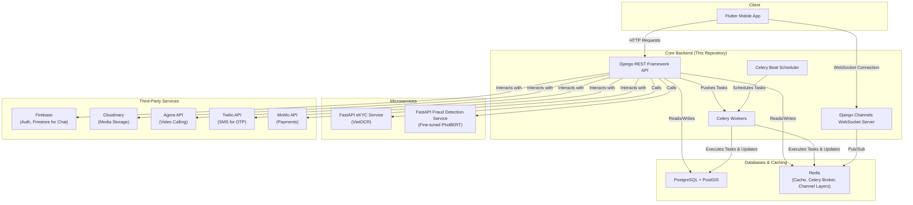

# Landify - Full-Stack Real Estate Platform (Backend)

[](https://www.python.org/)
[](https://www.djangoproject.com/)
[](https://www.django-rest-framework.org/)
[](https://postgis.net/)
[](https://www.docker.com/)
[](https://opensource.org/licenses/MIT)

## 📖 Overview

**Landify** is a comprehensive, full-stack real estate platform designed to modernize the property market by connecting buyers, sellers, renters, and agents in a seamless, secure, and intelligent ecosystem.

This repository contains the core backend infrastructure, built with **Django** and **Django REST Framework**. It provides a powerful, scalable, and feature-rich RESTful API that serves as the backbone for the entire platform, including the Flutter mobile client and specialized microservices.

-   **Frontend (Flutter) Repository:** [Flutter repo](https://github.com/anh-khoa-nguyen/LandifyFront)
-   **Microservices (FastAPI) Repository:** [FastAPI repo]

## 🏗️ System Architecture

Landify is built on a modern, distributed architecture to ensure scalability, maintainability, and high performance.



## ✨ Key Features

### 1. Real Estate Listings & Search
-   **Advanced CRUD:** Full create, read, update, and delete operations for property and listing data.
-   **Geospatial Search:** Powerful location-based filtering and search capabilities powered by **PostGIS**, including radius search and price analysis by geographic grid.
-   **Dynamic Filtering:** A comprehensive filtering system for listings based on price, area, property type, legal status, direction, and custom features.
-   **Public ID System:** User-friendly and non-sequential public IDs for listings using `hashids`.

### 2. AI-Powered Moderation & Fraud Detection
-   **Automated Spam/Scam Detection:** A fine-tuned **PhoBERT** model, deployed as a FastAPI microservice, analyzes new listings asynchronously via Celery to detect potential fraud, automatically flagging or deactivating suspicious content.
-   **Admin Moderation Tools:** A complete workflow for admins to handle user reports, review flagged content, and manage user/listing protests.

### 3. User Verification & Security (eKYC)
-   **Two-Step eKYC:** A robust identity verification process using FastAPI microservices:
    1.  **ID Card OCR:** Extracts information from ID cards using **VietOCR**.
    2.  **Liveness Verification:** Compares the user's live video feed with their ID card photo to prevent spoofing.
-   **Hybrid Authentication:** Secure authentication using **Firebase Auth** for mobile and WebSocket connections, and **Simple JWT** for standard API access.

### 4. Real-Time Communication Engine
-   **Live Chat:** A real-time messaging system built with **Django Channels** (WebSockets) and backed by **Firebase Firestore** for seamless message delivery and history.
-   **Video Calling:** Integrated **Agora API** for secure, real-time video consultations between users, with on-demand token generation.

### 5. Asynchronous Task Processing
-   **High-Performance Background Jobs:** Utilizes **Celery** and **Redis** to offload intensive tasks from the main request-response cycle, ensuring a fast user experience.
-   **Key Tasks:**
    -   AI-powered content moderation.
    -   Sending push notifications and alerts (via Firebase).
    -   Calculating and caching site-wide statistics.
    -   Periodically updating geospatial price analysis data.

### 6. Social & Interaction Features
-   **User Profiles & Following:** Users can create profiles, follow each other, and receive notifications about new listings from people they follow.
-   **Community Posts & Comments:** A social feed where users can create posts, comment, and react.
-   **Reviews & Ratings:** Verified users can leave reviews and ratings for properties.
-   **Appointments & Wishlists:** Users can schedule property viewings and maintain a personal wishlist of properties.

### 7. Value-Added Services
-   **Feng Shui Analysis:** A unique feature that analyzes the compatibility between a property's direction and a user's date of birth.
-   **Promotions & VIP System:** A flexible system for creating promotional codes and managing VIP listing packages with payment integration via **MoMo**.

## 🚀 Technology Stack

| Category                  | Technology / Service                                                                                                                              |
| ------------------------- | ------------------------------------------------------------------------------------------------------------------------------------------------- |
| **Backend Framework**     | **Django**, **Django REST Framework**, **Django Channels**                                                                                          |
| **Microservices**         | **FastAPI**                                                                                                                                       |
| **Database**              | **PostgreSQL** with **PostGIS** extension                                                                                                         |
| **Asynchronous Tasks**    | **Celery**, **Redis** (as Broker and Result Backend)                                                                                              |
| **Real-Time & Caching**   | **Redis** (for Channels Layer and Caching)                                                                                                        |
| **Authentication**        | **Firebase Authentication**, **Django REST Framework Simple JWT**                                                                                   |
| **AI & Machine Learning** | **PyTorch**, **PhoBERT** (for scam detection), **VietOCR** (for eKYC)                                                                               |
| **API Documentation**     | **drf-spectacular** (Swagger UI / Redoc)                                                                                                          |
| **DevOps & Deployment**   | **Docker**, **Docker Compose**                                                                                                                    |
| **Third-Party APIs**      | **Cloudinary** (Media Storage), **Twilio** (SMS), **Agora** (Video Call), **MoMo** (Payment Gateway), **Firebase Firestore** (Chat & Notifications) |

## ⚙️ Setup and Installation

This project is fully containerized using Docker for easy setup and consistent development environments.

### 1. Prerequisites
-   Docker
-   Docker Compose

### 2. Clone the Repository
```bash
git clone https://github.com/anh-khoa-nguyen/Landify.git
cd Landify/D:/Backend/Landify/landifyapis
```

### 3. Environment Variables
Create a `.env` file in the root directory (`landifyapis/`) by copying the example file:```bash
cp .env.example .env
```
Now, open the `.env` file and fill in your credentials for the database, Cloudinary, Twilio, Firebase, etc.

**Important:** Make sure your `GOOGLE_APPLICATION_CREDENTIALS` file (e.g., `serviceAccountKey.json`) is placed in the project's root directory and the filename matches the one specified in your `.env` file.

### 4. Build and Run with Docker Compose
From the root directory (`landifyapis/`), run the following command:
```bash
docker-compose up --build
```
This will build the images for the Django application, PostgreSQL/PostGIS, and Redis, and then start all the services.

### 5. Database Migrations
Once the containers are running, open a new terminal window and run the database migrations:
```bash
docker-compose exec web python manage.py migrate
```

### 6. Create a Superuser
To access the Django admin panel, create a superuser:
```bash
docker-compose exec web python manage.py createsuperuser
```
Follow the prompts to create your admin account.

### 7. Accessing the Application
-   **API Server:** `http://localhost:8000/`
-   **Django Admin:** `http://localhost:8000/admin/`

## 🛠️ Running Background Services

The Celery worker and scheduler are defined as services in `docker-compose.yml` and will start automatically with `docker-compose up`.

-   **`celery-worker`:** Processes asynchronous tasks from the Redis queue.
-   **`celery-beat`:** Schedules periodic tasks (e.g., updating stats, price analysis).

You can monitor their logs using:
```bash
docker-compose logs -f celery-worker
docker-compose logs -f celery-beat
```

## 📖 API Documentation

The API is fully documented using OpenAPI 3.0 standards via `drf-spectacular`. Once the server is running, you can access the interactive documentation at:

-   **Swagger UI:** `http://localhost:8000/api/schema/swagger-ui/`
-   **ReDoc:** `http://localhost:8000/api/schema/redoc/`

## 👤 Author

*   **Anh Khoa Nguyen** - [anh-khoa-nguyen](https://github.com/anh-khoa-nguyen)
